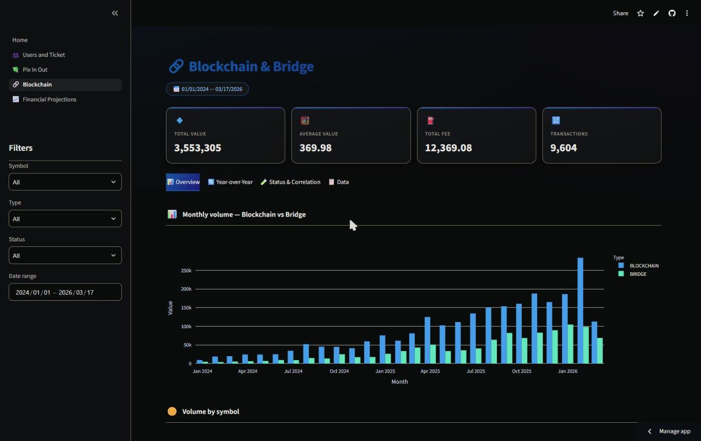
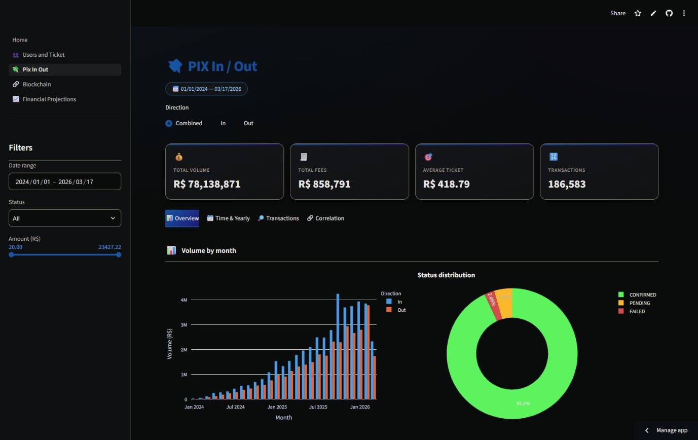
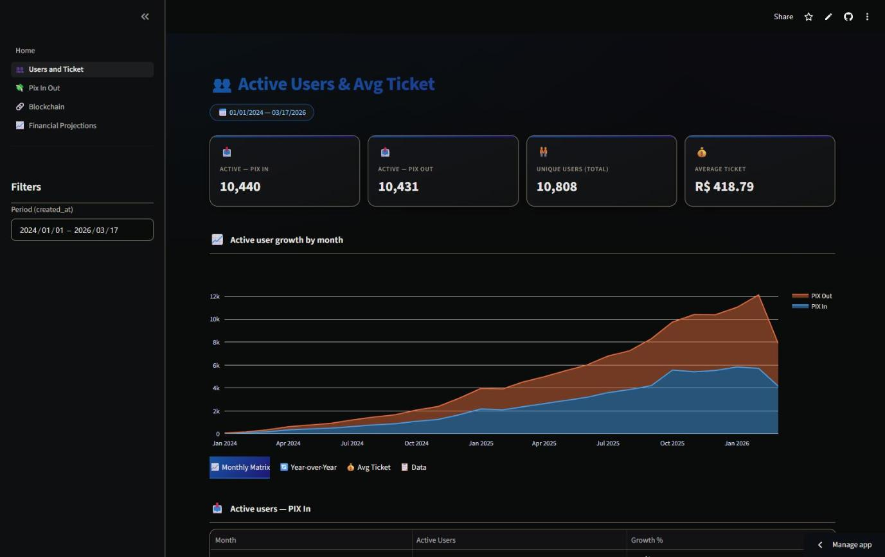
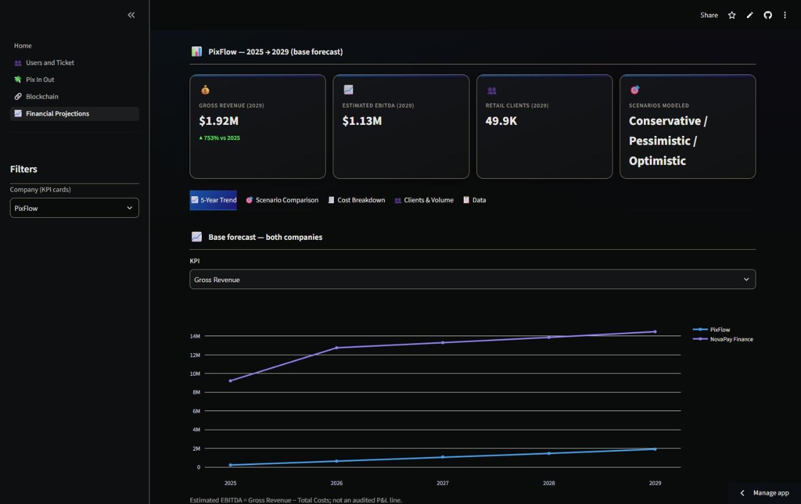

# 💠 PixFlow Analytics

**Data Analyst** portfolio project: a set of interactive Streamlit dashboards
for a fictional PIX and crypto payments fintech, built on **100% synthetic
data**.

🔗 **[Live demo](https://pix-analytics-portfolio.streamlit.app/)**

> **Disclaimer:** "PixFlow" is a fictional brand created solely for this
> portfolio. All users, transactions and volumes shown are generated by a
> deterministic script (`data_gen/generator.py`) — there is no connection to
> real people, companies or banks. The dashboard structure and metrics are
> inspired by panels I built professionally as a Data Analyst at a real
> fintech, but rebuilt from scratch for this repository.

## Preview



<table>
  <tr>
    <td></td>
    <td></td>
  </tr>
  <tr>
    <td colspan="2"></td>
  </tr>
</table>

## What this project demonstrates

- **End-to-end ownership** — synthetic data modeling, aggregation logic,
  KPI design and dashboard UX, all in one repo with no external dependencies.
- **Fintech domain knowledge** — PIX in/out flows, fees, transaction status,
  crypto/bridge activity and average ticket, the metrics payment teams
  actually track.
- **Business-oriented analysis** — year-over-year comparisons, monthly
  cohort-style matrices, value×fee correlation and multi-scenario financial
  projections (revenue, cost, client growth).
- **Reproducible, clean code** — deterministic generation from a fixed seed,
  cached with `st.cache_data`, shared chart theme, modular structure.
- **Data privacy awareness** — real-model figures are fictionalized and scaled
  before publishing; source files never enter the repository.

## Dashboards

- **👥 Users & Avg Ticket** — active users by PIX in/out, monthly matrix,
  year-over-year comparison and average ticket trend.
- **💸 PIX In/Out** — volume, fees, status distribution and value×fee
  correlation for incoming and outgoing PIX transactions.
- **🔗 Blockchain & Bridge** — on-chain activity by symbol (BTC, ETH, USDT,
  MATIC, SOL), year-over-year comparison and status analysis.
- **📈 Financial Projections** — revenue, cost and client-growth projections
  through 2029 across 3 scenarios (Conservative/Pessimistic/Optimistic), for
  the group's two companies. **Not synthetic** — see the disclaimer below.

> **A second disclaimer, specific to this one:** the Financial Projections
> dashboard is derived from real multi-year financial models I created
> professionally for two companies of a payments/fintech group. Company
> names and product lines are fictionalized, and every figure has additionally
> been scaled by an undisclosed, per-company factor before publishing (see
> `data_gen/financials.py`) — growth rates and cost/revenue ratios closely
> track the real model (aside from rounding), the absolute numbers do not.
> The source spreadsheets
> themselves are never committed to this repository (see `.gitignore`).

## Stack

- [Streamlit](https://streamlit.io/) — app and multi-page navigation
- [Plotly](https://plotly.com/python/) — visualizations, with a shared
  palette and template (`theme/charts.py`)
- pandas / numpy — synthetic data generation and aggregation
- statsmodels — trend lines and regression overlays

## Running locally

```bash
pip install -r requirements.txt
streamlit run Home.py
```

## Structure

```
pix-analytics-portfolio/
├── Home.py                  # landing page
├── pages/                   # the 4 dashboards
├── data_gen/
│   ├── generator.py          # deterministic synthetic dataset generator (fixed seed)
│   ├── names.py               # common BR names used only to give personas a realistic look
│   └── financials.py          # anonymized real financial KPIs (see disclaimer above)
└── theme/
    ├── style.py               # CSS + KPI card components
    └── charts.py              # shared Plotly palette and template
```

The entire dataset is generated in memory and cached (`st.cache_data`) from a
fixed seed — the numbers are always the same across runs and visitors, with
no need for a database or external files.

## Deploy

Live on Streamlit Community Cloud: https://pix-analytics-portfolio.streamlit.app/

## About the author

**Lucas Bastos** — Data Analyst focused on ETL, data modeling and revenue
analytics. First data hire at a crypto-payments fintech; previously in EdTech
planning/forecasting and manufacturing BI.

- 💼 [LinkedIn](https://www.linkedin.com/in/lucas-bastos-56756084/)
- 🐙 [GitHub](https://github.com/lucasboliv-coder)
- ✉️ [lucasboliv@gmail.com](mailto:lucasboliv@gmail.com)
