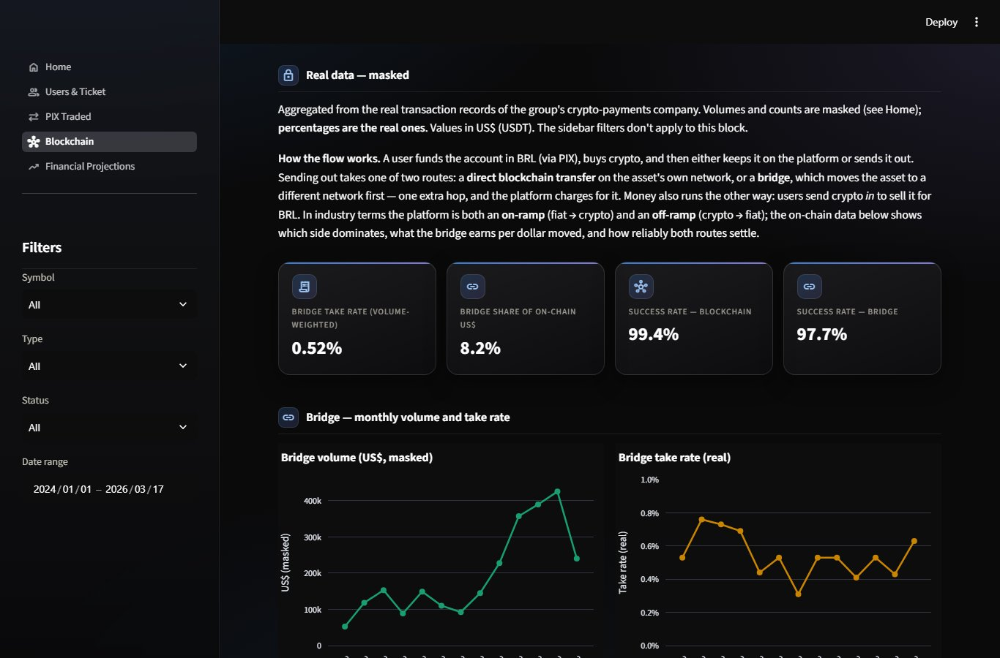
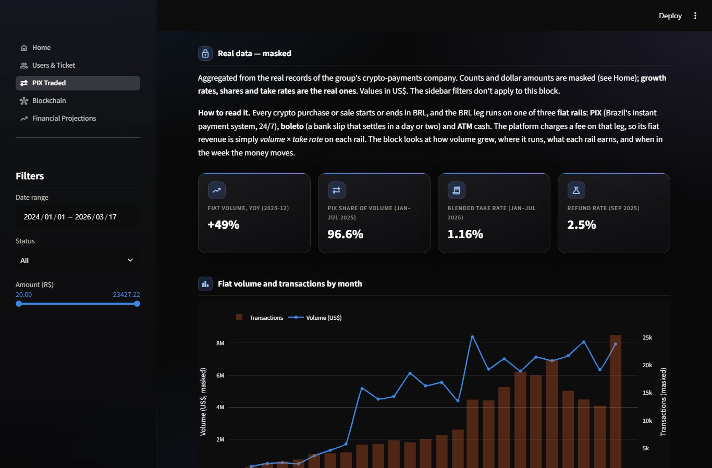
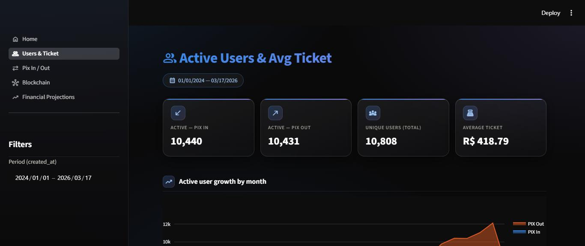
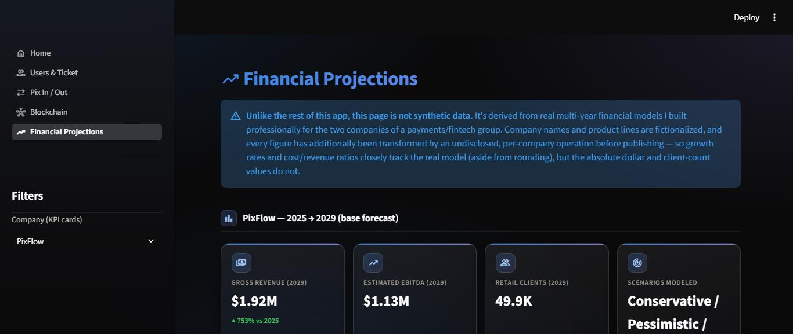

# PixFlow Analytics

**Data Analyst** portfolio project: a set of interactive Streamlit dashboards
for a fictional PIX and crypto payments fintech. Each product dashboard
(Users, PIX, Blockchain) opens with **real operating data, mathematically
masked**, followed by a **synthetic** transaction-level history; Financial
Projections runs on **real financial models, masked** — see the disclaimers
below.

**[Live demo](https://pix-analytics-portfolio.streamlit.app/)** — hosted on
Streamlit Community Cloud's free tier, which sleeps after a period of
inactivity. First load after a while may take ~30 seconds to wake up; it's
instant after that.

> **Disclaimer:** "PixFlow" is a fictional brand created solely for this
> portfolio. Transaction-level users, transactions and volumes are generated
> algorithmically (`data_gen/generator.py`, fixed seed) — there is no
> connection to real people, companies or banks. The growth curves, weekly
> seasonality and overall scale were checked against real usage numbers I
> have access to professionally as a Data Analyst at a real fintech.

## Preview



<table>
  <tr>
    <td></td>
    <td></td>
  </tr>
  <tr>
    <td colspan="2"></td>
  </tr>
</table>

## What this project demonstrates

- **End-to-end ownership** — synthetic data modeling, aggregation logic,
  KPI design and dashboard UX, all in one repo with no external dependencies.
- **Fintech domain knowledge** — PIX in/out flows, fees, transaction status,
  crypto/bridge activity and average ticket, the metrics payment teams
  actually track.
- **Business-oriented analysis** — year-over-year comparisons, monthly
  cohort-style matrices, value×fee correlation and multi-scenario financial
  projections (revenue, cost, client growth).
- **Reproducible, clean code** — deterministic generation from a fixed seed,
  cached with `st.cache_data`, shared chart theme, modular structure.
- **Data privacy awareness** — real-model figures are fictionalized and
  transformed before publishing; source files never enter the repository.

## Dashboards

- **Users & Avg Ticket** — opens with **real data, masked**: active users
  (2024-2025), the sign-up → KYC funnel and the in/out average ticket, in
  US$. Below it, synthetic monthly matrix, year-over-year and ticket views.
- **PIX Traded** — opens with **real data, masked**: fiat volume and
  transactions (2024-2025, US$), rail mix and take rate by rail (PIX, boleto,
  ATM) and the weekday pattern. Below it, synthetic direction, status and
  value×fee views.
- **Blockchain & Bridge** — opens with **real on-chain data, masked**:
  monthly bridge volume and take rate, plus a route/direction/symbol/success
  snapshot, in US$. Below it, a synthetic transaction-level history
  (USDT, BTC and a fictional platform token, PFT) calibrated to that
  snapshot, with year-over-year comparison and status analysis.
- **Financial Projections** — revenue, cost and client-growth projections
  through 2029 across 3 scenarios (Conservative/Pessimistic/Optimistic), for
  the group's two companies, plus a first plan-vs-actual check. **Not
  synthetic** — see the disclaimer below.

> **A second disclaimer, specific to this one:** the Financial Projections
> dashboard is real data, mathematically masked — derived from real
> multi-year financial models I created professionally for two companies of
> a payments/fintech group. Company names and product lines are
> fictionalized, and every figure has additionally been run through a
> random, per-company mathematical operation — generated once and never
> recorded (see `data_gen/financials.py`) — before publishing, so growth
> rates and cost/revenue ratios closely track the real model (aside from
> rounding), the absolute numbers do not.
> The source spreadsheets
> themselves are never committed to this repository (see `.gitignore`).
>
> The same approach covers the real blocks on the Users, PIX and Blockchain
> pages (`data_gen/fiat_real.py`, `data_gen/chain_real.py`): only monthly
> aggregates leave the source — no names, addresses, hashes or user-level
> data — with counts and dollar amounts masked and percentages (growth,
> shares, conversion and take rates) kept real.

## Stack

- [Streamlit](https://streamlit.io/) — app and multi-page navigation
- [Plotly](https://plotly.com/python/) — visualizations, with a shared
  palette and template (`theme/charts.py`)
- pandas / numpy — synthetic data generation and aggregation
- statsmodels — trend lines and regression overlays

## Running locally

```bash
pip install -r requirements.txt
streamlit run Home.py
```

## Structure

```
pix-analytics-portfolio/
├── Home.py                  # entry point: page config + st.navigation router
├── pages/
│   ├── home.py                # landing page content
│   └── ...                    # the 4 dashboards
├── data_gen/
│   ├── generator.py          # deterministic synthetic dataset generator (fixed seed)
│   ├── names.py               # common BR names used only to give personas a realistic look
│   ├── chain_real.py          # masked real on-chain monthly aggregates (see disclaimer above)
│   ├── fiat_real.py           # masked real user and fiat-rail monthly aggregates
│   ├── plan_vs_actual.py      # realized ÷ projected ratios (first out-of-sample check)
│   └── financials.py          # anonymized real financial KPIs (see disclaimer above)
└── theme/
    ├── style.py               # CSS (glassmorphism) + KPI card components
    ├── charts.py               # shared Plotly palette and template
    ├── icons.py                # Material Symbols icon set (no emoji, OS-consistent)
    └── narrative.py             # data-to-prose helpers for the year-over-year tabs
```

The entire dataset is generated in memory and cached (`st.cache_data`) from a
fixed seed — the numbers are always the same across runs and visitors, with
no need for a database or external files.

## Deploy

Live on Streamlit Community Cloud: https://pix-analytics-portfolio.streamlit.app/

## About the author

**Lucas Bastos** — Data Analyst focused on ETL, data modeling and revenue
analytics. First data hire at a crypto-payments fintech; previously in EdTech
planning/forecasting and manufacturing BI.

- [Resume (PDF)](docs/Lucas_Bastos_Resume.pdf)
- [LinkedIn](https://www.linkedin.com/in/lucas-bastos-56756084/)
- [GitHub](https://github.com/lucasboliv-coder)
- [lucasboliv@gmail.com](mailto:lucasboliv@gmail.com)
